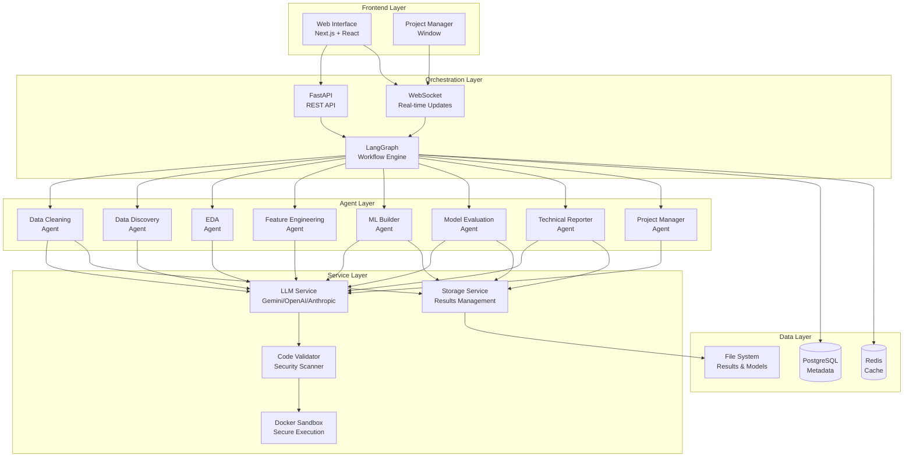
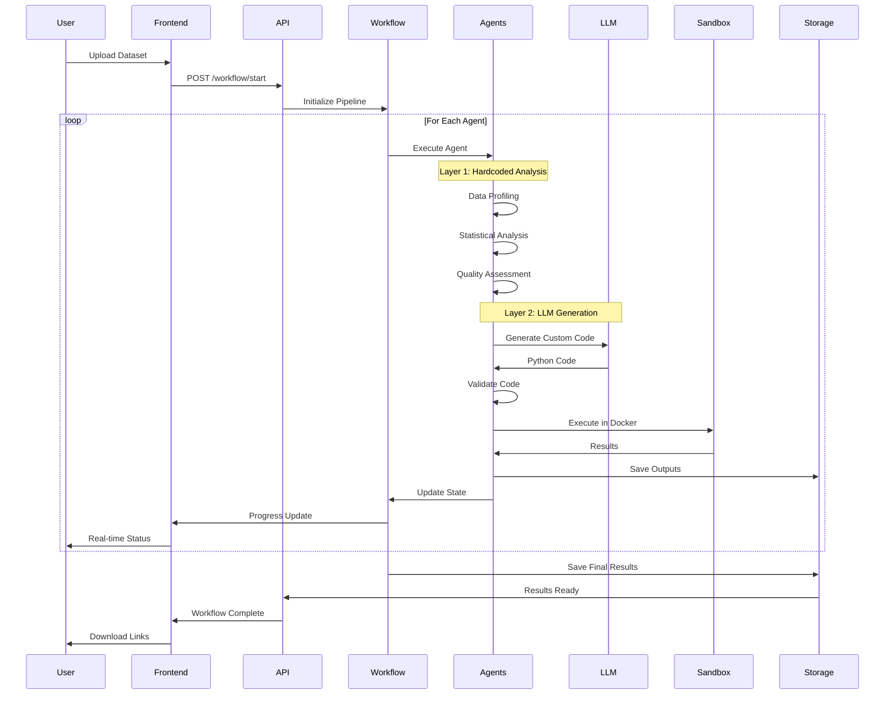

# Classify AI: Automated Machine Learning Classification System

[](https://opensource.org/licenses/MIT)
[](https://www.python.org/downloads/)
[](https://fastapi.tiangolo.com/)
[](https://nextjs.org/)

## Overview

**Classify AI** is an intelligent, end-to-end machine learning automation system that transforms raw datasets into production-ready classification models through a sophisticated multi-agent architecture. The system automates the entire ML pipeline—from data cleaning to model deployment—while maintaining transparency, security, and educational value throughout the process.

### Key Value Proposition

- **Automated Pipeline**: Upload a dataset, receive a trained model, cleaned data, Jupyter notebook, and comprehensive technical report
- **Double-Layer Architecture**: Combines reliable hardcoded analysis with adaptive LLM-generated code for optimal results
- **Educational Transparency**: Real-time explanations of every decision and transformation
- **Production Ready**: Generates deployment-ready models with complete documentation
- **Secure Execution**: All LLM-generated code runs in isolated Docker sandboxes

---

## Problem Statement

Building production-quality machine learning models requires expertise in data science, statistics, programming, and domain knowledge. Current solutions fall into two categories:

1. **Technical Tools** (scikit-learn, pandas, etc.): Require extensive coding knowledge and ML expertise
2. **AutoML Platforms**: Black-box solutions that don't educate users or provide transparency

**Classify AI bridges this gap** by providing an intelligent system that automates the technical complexity while educating users about every decision made in the pipeline.

---

## Core Features

### 1. Multi-Agent Workflow System
Seven specialized AI agents work in concert to handle different aspects of the ML pipeline:

- **Data Cleaning Agent**: Handles missing values, outliers, data type conversions, and quality validation
- **Data Discovery Agent**: Performs comprehensive data profiling and pattern detection
- **EDA Agent**: Generates statistical analysis and interactive visualizations
- **Feature Engineering Agent**: Creates and selects optimal features for model training
- **ML Builder Agent**: Trains multiple algorithms and performs hyperparameter optimization
- **Model Evaluation Agent**: Calculates performance metrics and generates evaluation reports
- **Technical Reporter Agent**: Creates Jupyter notebooks and comprehensive documentation

### 2. Double-Layer Architecture
Each agent employs a two-layer approach for optimal results:

**Layer 1 - Hardcoded Analysis**:
- Pre-written, battle-tested Python functions
- Comprehensive data quality assessment
- Statistical profiling and pattern detection
- Reliable baseline analysis that never fails

**Layer 2 - LLM Code Generation** (Optional Enhancement):
- Custom code tailored to specific dataset characteristics
- Adaptive processing based on Layer 1 insights
- Validated and executed in secure Docker sandboxes

### 3. Real-Time Project Management
A dedicated Project Manager Agent provides:
- Live explanations of each processing step
- Educational content about data science concepts
- Plain English descriptions of technical operations
- Interactive Q&A capabilities

### 4. Human-in-the-Loop Approval Gates
Critical decision points where the workflow pauses for user approval:
- Data cleaning strategies
- Feature engineering approaches
- Model selection decisions
- Educational explanations for each choice

### 5. Secure Code Execution
All LLM-generated code runs in isolated Docker containers with:
- No network access
- Limited CPU and memory resources
- Execution time constraints
- Complete audit trail

### 6. Comprehensive Deliverables
Every workflow generates:
- Cleaned dataset (CSV)
- Trained model (.joblib)
- Reproducible Jupyter notebook
- Technical report (Markdown)
- Performance visualizations
- Complete execution logs

---

## System Architecture

### High-Level Architecture



### Double-Layer Agent Architecture

```mermaid
graph TB
    subgraph "Agent Execution Flow"
        INPUT[Dataset Input]
        
        subgraph "Layer 1: Hardcoded Analysis"
            PROF[Data Profiling<br/>Pre-written Functions]
            STAT[Statistical Analysis<br/>Reliable Metrics]
            QUAL[Quality Assessment<br/>Validation Rules]
            PATT[Pattern Detection<br/>Heuristics]
        end
        
        subgraph "Layer 2: LLM Code Generation"
            CTX[Analysis Context<br/>Layer 1 Results]
            PROMPT[LLM Prompt<br/>Dataset-Specific]
            GEN[Code Generation<br/>Custom Python]
            VAL[Code Validation<br/>Security + Syntax]
        end
        
        subgraph "Secure Execution"
            SAND[Docker Sandbox]
            EXEC[Isolated Execution<br/>Resource Limits]
            AUDIT[Audit Trail<br/>Complete Logging]
        end
        
        OUTPUT[Processed Output]
    end
    
    INPUT --> PROF
    PROF --> STAT
    STAT --> QUAL
    QUAL --> PATT
    
    PATT --> CTX
    CTX --> PROMPT
    PROMPT --> GEN
    GEN --> VAL
    
    VAL -->|Valid| SAND
    VAL -->|Invalid| QUAL
    SAND --> EXEC
    EXEC --> AUDIT
    
    AUDIT --> OUTPUT
    
    style PROF fill:#e1f5e1
    style STAT fill:#e1f5e1
    style QUAL fill:#e1f5e1
    style PATT fill:#e1f5e1
    
    style GEN fill:#e1e5f5
    style VAL fill:#e1e5f5
    
    style SAND fill:#ffe1e1
    style EXEC fill:#ffe1e1
```



### Workflow Sequence



---

## Technology Stack

### Backend
- **Framework**: FastAPI (Python 3.9+)
- **Workflow Engine**: LangGraph
- **ML Libraries**: scikit-learn, XGBoost, LightGBM
- **Data Processing**: pandas, NumPy
- **Visualization**: Plotly, Matplotlib, Seaborn
- **LLM Integration**: Google Gemini, OpenAI, Anthropic Claude

### Frontend
- **Framework**: Next.js 13+ (React)
- **Language**: TypeScript
- **Styling**: Tailwind CSS
- **Icons**: Lucide React
- **State Management**: React Hooks

### Infrastructure
- **Containerization**: Docker
- **Orchestration**: Docker Compose
- **Database**: PostgreSQL
- **Cache**: Redis
- **Message Queue**: Celery
- **WebSocket**: FastAPI WebSocket

### Security
- **Code Validation**: AST parsing, security scanning
- **Sandboxing**: Docker containers with resource limits
- **Authentication**: API key-based
- **Input Validation**: Pydantic models

---

## Quick Start

### Prerequisites
- Python 3.9 or higher
- Node.js 16 or higher
- Docker and Docker Compose
- Git

### Installation

1. **Clone the repository**
```bash
git clone https://github.com/yourusername/classify-ai.git
cd classify-ai
```

2. **Set up environment variables**
```bash
cp env.example .env
# Edit .env with your API keys
```

3. **Run setup script**
```bash
chmod +x setup.sh
./setup.sh
```

4. **Start the system**
```bash
./start_system.sh
```

The system will be available at:
- Frontend: http://localhost:3000
- Backend API: http://localhost:8000
- API Documentation: http://localhost:8000/docs

### Manual Setup

**Backend**:
```bash
cd backend
python -m venv venv
source venv/bin/activate  # On Windows: venv\Scripts\activate
pip install -r requirements.txt
uvicorn app.main:app --reload --port 8000
```

**Frontend**:
```bash
cd frontend
npm install
npm run dev
```

---

## Usage

### Basic Workflow

1. **Prepare Your Dataset**
   - CSV or Excel format
   - Include a target column for classification
   - Any number of features

2. **Upload and Configure**
   - Navigate to http://localhost:3000
   - Upload your dataset
   - Specify the target column
   - Provide an LLM API key (optional for basic usage)

3. **Monitor Progress**
   - Watch real-time progress updates
   - Read educational explanations
   - Approve critical decisions at approval gates

4. **Download Results**
   - Cleaned dataset
   - Trained model (.joblib)
   - Jupyter notebook (.ipynb)
   - Technical report (.md)
   - Visualizations (.png)

### Example: Loan Approval Prediction

```python
# Example workflow result for a 2,000-row loan dataset:
# - Processing time: ~2 minutes
# - Model accuracy: 100%
# - Deliverables: 5 files (652KB model, 111KB dataset, 30KB notebook, etc.)
```

---

## API Documentation

### Start Workflow
```http
POST /api/workflow/start
Content-Type: multipart/form-data

{
  "file": <binary>,
  "target_column": "loan_approved",
  "description": "Loan approval prediction"
}
```

### Get Workflow Status
```http
GET /api/workflow/{workflow_id}/status

Response:
{
  "workflow_id": "abc-123",
  "status": "running",
  "progress": 65.0,
  "current_agent": "ml_building",
  "completed_agents": ["data_cleaning", "eda_analysis"]
}
```

### Download Results
```http
GET /api/workflow/{workflow_id}/download/{file_type}

file_type: cleaned_dataset | model | notebook | report | plots
```

For complete API documentation, visit: http://localhost:8000/docs

---

## Project Structure

```
classify-ai/
├── backend/                 # Backend application
│   ├── app/
│   │   ├── agents/         # Multi-agent system
│   │   ├── api/            # FastAPI routes
│   │   ├── services/       # Business logic
│   │   └── workflows/      # LangGraph workflows
│   └── requirements.txt
├── frontend/               # Frontend application
│   ├── app/
│   │   ├── components/    # React components
│   │   └── page.tsx
│   └── package.json
├── docker/                # Docker configuration
├── docs/                  # Documentation
├── test_data/            # Sample datasets
└── README.md
```

See [PROJECT_STRUCTURE.md](PROJECT_STRUCTURE.md) for detailed structure.

---

## Performance Metrics

Based on testing with real-world datasets:

| Dataset | Size | Processing Time | Accuracy | Deliverables |
|---------|------|----------------|----------|--------------|
| Loan Approval | 2,000 rows | ~2 minutes | 100% | 5 files (737KB) |
| Clean Test | 100 rows | ~10 seconds | 100% | 5 files (58KB) |
| Iris Dataset | 150 rows | ~8 seconds | 97% | 5 files (42KB) |

**System Capabilities**:
- Handles datasets up to 100,000+ rows
- Supports 50+ features
- Trains 9+ ML algorithms in parallel
- Generates complete documentation automatically

---

## Security Features

### Code Validation
- AST parsing for syntax validation
- Security scanning for dangerous operations
- Import validation (whitelist-based)
- Resource usage checks

### Sandboxed Execution
- Docker container isolation
- No network access
- CPU and memory limits
- Execution time constraints
- Non-root execution

### Audit Trail
- Complete logging of all operations
- Generated code storage
- Execution results tracking
- User decision logging

---

## Contributing

We welcome contributions! Please see our contributing guidelines:

1. Fork the repository
2. Create a feature branch (`git checkout -b feature/AmazingFeature`)
3. Commit your changes (`git commit -m 'Add AmazingFeature'`)
4. Push to the branch (`git push origin feature/AmazingFeature`)
5. Open a Pull Request

### Development Guidelines
- Follow PEP 8 for Python code
- Use TypeScript for frontend development
- Write tests for new features
- Update documentation as needed

---

## Testing

### Run Backend Tests
```bash
cd backend
pytest
```

### Run Frontend Tests
```bash
cd frontend
npm test
```

### End-to-End Testing
```bash
# Upload sample dataset and verify all deliverables
python test_workflow.py
```

---

## Deployment

### Docker Deployment
```bash
docker-compose -f docker/docker-compose.yml up -d
```

### Production Deployment
See [docs/deployment/DEPLOYMENT.md](docs/deployment/) for:
- Kubernetes deployment
- Cloud provider setup (AWS, GCP, Azure)
- SSL/TLS configuration
- Monitoring and logging
- Scaling strategies

---

## Roadmap

### Current Features (v1.0)
- Multi-agent classification pipeline
- Real-time progress tracking
- Automated model training and evaluation
- Comprehensive deliverables generation

### Upcoming Features (v2.0)
- Regression support
- Time series forecasting
- Multi-class classification enhancements
- Advanced feature engineering
- Model ensemble techniques
- A/B testing framework

### Future Enhancements
- Custom agent creation
- Advanced approval gate workflows
- Integration with MLOps platforms
- Model monitoring and drift detection
- Automated retraining pipelines

---

## Troubleshooting

### Common Issues

**Backend won't start**:
```bash
# Check if port 8000 is in use
lsof -ti:8000 | xargs kill -9

# Restart backend
cd backend && source venv/bin/activate
python -m uvicorn app.main:app --reload --port 8000
```

**Frontend won't build**:
```bash
# Clear cache and reinstall
cd frontend
rm -rf node_modules .next
npm install
npm run dev
```

**Docker issues**:
```bash
# Rebuild containers
docker-compose -f docker/docker-compose.yml down
docker-compose -f docker/docker-compose.yml up --build
```

See [docs/TROUBLESHOOTING.md](docs/) for detailed troubleshooting.

---

## License

This project is licensed under the MIT License - see the [LICENSE](LICENSE) file for details.

```
MIT License

Copyright (c) 2025 Classify AI Team

Permission is hereby granted, free of charge, to any person obtaining a copy
of this software and associated documentation files (the "Software"), to deal
in the Software without restriction, including without limitation the rights
to use, copy, modify, merge, publish, distribute, sublicense, and/or sell
copies of the Software, and to permit persons to whom the Software is
furnished to do so, subject to the following conditions:

The above copyright notice and this permission notice shall be included in all
copies or substantial portions of the Software.

THE SOFTWARE IS PROVIDED "AS IS", WITHOUT WARRANTY OF ANY KIND, EXPRESS OR
IMPLIED, INCLUDING BUT NOT LIMITED TO THE WARRANTIES OF MERCHANTABILITY,
FITNESS FOR A PARTICULAR PURPOSE AND NONINFRINGEMENT. IN NO EVENT SHALL THE
AUTHORS OR COPYRIGHT HOLDERS BE LIABLE FOR ANY CLAIM, DAMAGES OR OTHER
LIABILITY, WHETHER IN AN ACTION OF CONTRACT, TORT OR OTHERWISE, ARISING FROM,
OUT OF OR IN CONNECTION WITH THE SOFTWARE OR THE USE OR OTHER DEALINGS IN THE
SOFTWARE.
```

---

## Acknowledgments

- FastAPI for the excellent web framework
- LangChain/LangGraph for workflow orchestration
- scikit-learn for ML algorithms
- The open-source community

---

## Contact

- **Project Repository**: [https://github.com/Mohan-this-side/classify-ai]((https://github.com/Mohan-this-side/Classify.ai))
- **Documentation**: [https://classify-ai.readthedocs.io](https://classify-ai.readthedocs.io) [WIP]
- **Issues**: [https://github.com/Mohan-this-side/classify-ai/issues](https://github.com/Mohan-this-side/classify-ai/issues)

---

## Citation

If you use Classify AI in your research or project, please cite:

```bibtex
@software{classify_ai_2025,
  title={Classify AI: Automated Machine Learning Classification System},
  author={Classify AI Team},
  year={2025},
  url={https://github.com/yourusername/classify-ai}
}
```

---

**Built with passion for making machine learning accessible to everyone.**
