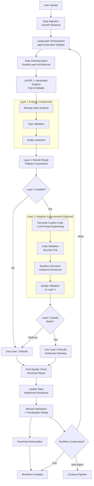

# Data Cleaning Agent Workflow Diagrams

Three presentation-ready Mermaid flowchart diagrams describing the Data Cleaning Agent's double-layer architecture workflow.

---

## Version 1: Detailed Pipeline with Double-Layer Architecture

This version provides a comprehensive view of both Layer 1 and Layer 2 execution paths, emphasizing the double-layer architecture.

```mermaid
graph TD
    A[User Upload] --> B[File Upload Pipeline<br/>✓ FastAPI Backend]
    B --> C[LangGraph Orchestration<br/>Agent Workflow Manager]
    C --> D[Data Cleaning Agent<br/>✓ Enhanced v3.0.0]
    
    D --> E[LAYER 1: Hardcoded Analysis<br/>🔍 Always Executes]
    
    subgraph "Layer 1: Reliable Analysis Components"
        direction TD
        L1A[Missing Value Analyzer<br/>Comprehensive Analysis]
        L1B[Data Type Validator<br/>Type Detection & Issues]
        L1C[Outlier Detector<br/>Statistical Detection]
        L1D[Compile Analysis Results<br/>Quality Metrics & Insights]
        L1A --> L1B --> L1C --> L1D
    end
    
    E --> L1A
    L1D --> F{Layer 2 Enabled?}
    
    subgraph "Layer 2: LLM + Sandbox (Optional)"
        direction TD
        L2A[Generate LLM Prompt<br/>Based on Layer 1 Insights]
        L2B[LLM Code Generation<br/>Gemini/OpenAI/Claude]
        L2C[Code Validation<br/>Security & Syntax Check]
        L2D[Sandbox Execution<br/>🔒 Docker Isolated]
        L2E[Result Processing<br/>Quality Comparison]
        L2A --> L2B --> L2C --> L2D --> L2E
    end
    
    F -- Yes --> L2A
    F -- No --> H[Use Layer 1 Results]
    L2E --> G{Layer 2 Success?}
    
    G -- Success --> I[Layer 2 Results<br/>Enhanced Cleaning]
    G -- Failed/Timeout --> H
    
    subgraph "Quality Assurance & Output"
        direction TD
        QA1[Validate Output Quality<br/>Compare to Layer 1]
        QA2[Generate Cleaning Report<br/>Actions & Metrics]
        QA3[Educational Explanations<br/>User-Friendly Insights]
        QA4[Update Workflow State<br/>WebSocket Broadcast]
        QA1 --> QA2 --> QA3 --> QA4
    end
    
    H --> QA1
    I --> QA1
    QA4 --> J[Results Visualization<br/>Dashboard ✓ Working]
    J --> K[Download Results<br/>Cleaned Dataset + Report]
    K --> L[Pipeline Complete]
    
    J --> M{Retry Agent?}
    M -- Yes --> C
    M -- No --> N[End Workflow]
```

---

## Version 2: Simplified Flow Emphasizing Decision Points

This version highlights the key decision points and fallback mechanisms, suitable for high-level presentations.

---

## Version 3: Emphasizing Safety & Validation Layers

This version emphasizes the security, validation, and quality assurance aspects, making it ideal for technical/security-focused presentations.

```mermaid
graph TD
    subgraph "Initial Processing"
        direction TD
        A[User Upload Dataset] --> B[FastAPI File Upload<br/>Validation & Storage]
        B --> C[LangGraph Workflow<br/>Orchestration Manager]
    end
    
    C --> D[Data Cleaning Agent<br/>🚀 Execution Started]
    
    subgraph "Layer 1: Core Analysis (Deterministic)"
        direction TD
        D1[Missing Value Analyzer<br/>MCAR/MAR Pattern Detection]
        D2[Data Type Validator<br/>Type Consistency Check]
        D3[Outlier Detector<br/>Statistical Methods]
        D4[Compile Insights<br/>Analysis Complete]
        D1 --> D2 --> D3 --> D4
    end
    
    D --> D1
    D4 --> L2_CHECK{Layer 2<br/>Available?}
    
    subgraph "Layer 2: Adaptive Enhancement"
        direction TD
        L2_CHECK -- Yes --> E1[Build LLM Prompt<br/>Context from Layer 1]
        E1 --> E2[LLM Code Generation<br/>Custom Cleaning Logic]
        
        subgraph "Security & Validation"
            direction TD
            V1[Code Validator<br/>AST Parsing & Security Scan]
            V2[Import Whitelist Check<br/>Allowed Libraries Only]
            V3[Syntax Validation<br/>Python Compliance]
            V1 --> V2 --> V3
        end
        
        E2 --> V1
        V3 --> SAND{Validation<br/>Passed?}
        
        subgraph "Sandbox Execution"
            direction TD
            S1[Docker Container<br/>Isolated Environment]
            S2[Resource Limits<br/>Memory & CPU Enforced]
            S3[No Network Access<br/>Complete Isolation]
            S4[Execution Monitoring<br/>Real-time Logging]
            S1 --> S2 --> S3 --> S4
        end
        
        SAND -- Pass --> S1
        SAND -- Fail --> FALL1[Fallback to Layer 1]
        
        S4 --> RESULT{Execution<br/>Success?}
        
        subgraph "Result Processing"
            direction TD
            R1[Extract Cleaned Data<br/>Validate Structure]
            R2[Quality Comparison<br/>Layer 2 vs Layer 1]
            R3[Ensure Improvement<br/>Quality Check]
            R1 --> R2 --> R3
        end
        
        RESULT -- Success --> R1
        RESULT -- Timeout/Error --> FALL1
        
        R3 --> FINAL{Layer 2<br/>Better?}
        FINAL -- Yes --> L2_RESULT[Layer 2 Results<br/>Enhanced Output]
        FINAL -- No --> FALL1
    end
    
    L2_CHECK -- No --> L1_RESULT[Layer 1 Results<br/>Reliable Output]
    FALL1 --> L1_RESULT
    L2_RESULT --> OUTPUT
    L1_RESULT --> OUTPUT
    
    subgraph "Final Output Generation"
        direction TD
        OUTPUT[Generate Deliverables]
        OUT1[Cleaned Dataset<br/>Quality Improved]
        OUT2[Cleaning Report<br/>Actions & Metrics]
        OUT4[Educational Content<br/>User Explanations]
        OUT3[State Update<br/>WebSocket Broadcast]
        OUTPUT --> OUT1 --> OUT2 --> OUT4 --> OUT3
    end
    
    OUT3 --> UI[Results Dashboard<br/>Real-time Visualization]
    UI --> DOWN[Download Results]
    DOWN --> COMPLETE[Workflow Complete]
    
    UI --> DECIDE{Next Action?}
    DECIDE -- Continue Pipeline --> NEXT[Next Agent]
    DECIDE -- Retry --> C
    DECIDE -- End --> COMPLETE
```

---

## Usage Instructions

### For Presentations:

1. **Version 1**: Use for detailed technical presentations where you want to show the complete architecture
2. **Version 2**: Use for executive/overview presentations where decision points are key
3. **Version 3**: Use for security/engineering-focused presentations emphasizing validation and safety

### How to Embed:

Copy the desired version's Mermaid code and paste it into:
- Markdown files (GitHub, GitLab, etc.)
- Mermaid Live Editor: https://mermaid.live/
- Presentation tools with Mermaid support (Reveal.js, etc.)
- Documentation sites (MkDocs, Docusaurus, etc.)

### Customization Tips:

- Adjust colors by adding `style` directives
- Modify node shapes for emphasis (`A[text]` for rectangle, `A((text))` for circle)
- Change arrow styles: `-->` for solid, `-.->` for dashed, `==>` for bold

---

**Generated**: 2025-01-27
**Agent Version**: Enhanced Data Cleaning Agent v3.0.0
**Architecture**: Double-Layer (Layer 1: Hardcoded, Layer 2: LLM + Sandbox)

